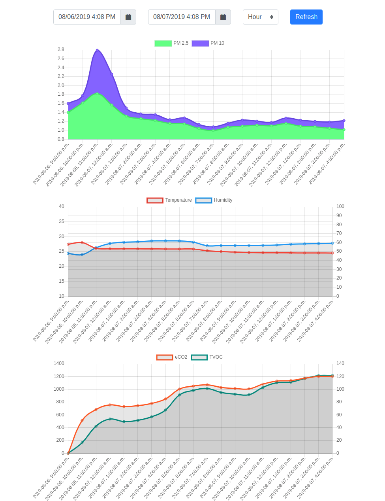
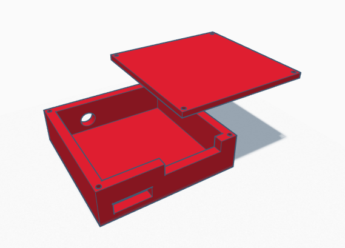

# air-quality-station
Combining the SNS011 sensor with an OrangePI to displays:

- PM2.5 and PM10 air quality measurements
- eCO2 and TVOC polluants concentration measurements
- Temperature and Humidity measurements

## UI

The basic chart UI allows for easy reading of the air quality data for a given interval.

## Hardware

- [SNS011 air quality sensor](https://www.aliexpress.com/item/Laser-PM2-5-sensor-SDS011-particle-sensor-dust-sensor/32724933436.html?spm=a2g0s.9042311.0.0.ca304c4dQQAiml)
- [CCS811 organic compound sensor](https://www.aliexpress.com/item/32965992860.html?spm=a2g0s.9042311.0.0.55a06c37P8xJBy)
- [DHT22 temperature and humidity sensor](https://www.amazon.ca/gp/product/B06Y63YMSS/ref=ppx_yo_dt_b_asin_title_o00_s00?ie=UTF8&psc=1) (Bought from Amazon for the fast shipping, is much cheaper on AliExpress)
- [Orange Pi Zero H2](https://www.aliexpress.com/item/New-Orange-Pi-Zero-H2-Quad-Core-Open-source-512MB-development-board-beyond-Raspberry-Pi/32761500374.html?spm=a2g0s.9042311.0.0.27424c4d73P8NR)
    - Any RasPi-like system would do
- Power adapter
- 4GB+ microSD card

## Case

There is a 3D printable case model for the SNS011 available in the `case/` directory.

## Future enhancement

- Better CO2 monitoring, while the CCS811 seems to be working, using a MOx sensor as a way to estimate CO2 concentration is highly controversial.
- Better dashboard
