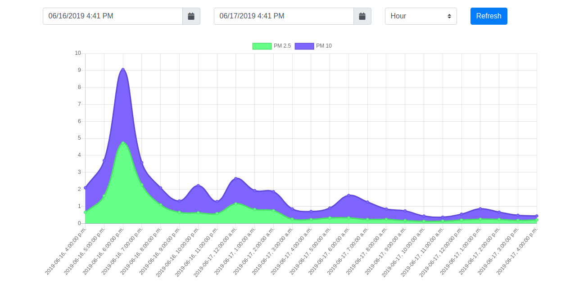

# air-quality-station
Combining the SNS011 sensor with an OrangePI to display PM2.5 and PM10 air quality measurements

## UI

The basic chart UI allows for easy reading of the air quality date for a given interval.

## Hardware

- [SNS011 air quality sensor](https://www.aliexpress.com/item/Laser-PM2-5-sensor-SDS011-particle-sensor-dust-sensor/32724933436.html?spm=a2g0s.9042311.0.0.ca304c4dQQAiml)
- [Orange Pi Zero H2](https://www.aliexpress.com/item/New-Orange-Pi-Zero-H2-Quad-Core-Open-source-512MB-development-board-beyond-Raspberry-Pi/32761500374.html?spm=a2g0s.9042311.0.0.27424c4d73P8NR)
    - Any RasPi-like system would do
- Power adapter
- 4GB+ microSD card

## Future enhancement

Since air quality is heavily affected by humidity and temperature, it would be interesting to add theses metrics to the dashboard.